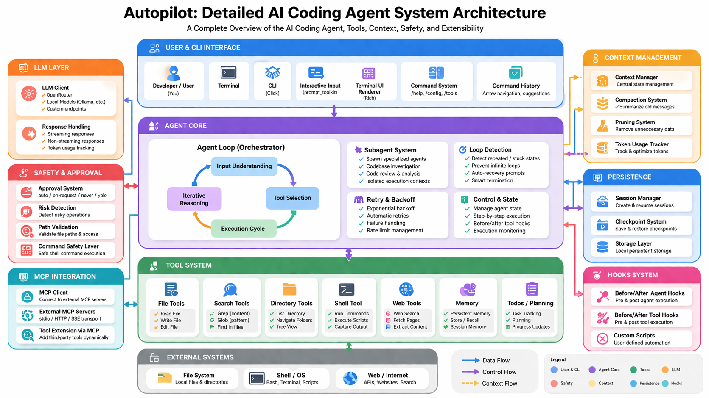

# Autopilot — AI Coding Agent (Built from First Principles)

Autopilot is a terminal-based AI agent that can **understand entire codebases, execute complex multi-step tasks, manage long-running workflows, and operate autonomously within controlled limits**.

It is built entirely in Python **without using frameworks like LangChain**, focusing on **control, transparency, and reliability**.

---

## System Architecture



---

## Overview

This project implements a **complete agent system from scratch**, including:

* Custom agent loop
* Tool calling system
* Context management (compaction + pruning)
* Session and checkpoint persistence
* Sub-agents for complex workflows
* MCP-based extensibility
* Safety and approval controls

The system is designed to run continuously until tasks are completed, while maintaining correctness and avoiding uncontrolled behavior.

---

## Features

### Core Functionality

* Interactive CLI mode for continuous workflows
* Single-run mode for automation tasks
* Streaming and non-streaming LLM responses
* Multi-turn reasoning with tool execution
* Retry mechanism with exponential backoff
* Configurable model, temperature, and behavior

---

### Agent Loop

A fully custom-built execution loop:

* Interprets user intent  
* Breaks tasks into steps  
* Selects tools  
* Executes actions  
* Updates context dynamically  

Runs until the task is completed or safely terminated.

---

### Tool System

The agent interacts with the environment strictly through tools.

**File Operations**
* `read_file`, `write_file`, `edit_file`

**Search & Navigation**
* `list_dir`, `glob`, `grep`

**Execution**
* `shell`

**Web**
* `web_search`, `web_fetch`

**Planning & Memory**
* `todos`, `memory`

---

### Context Management

Built for **large codebases + long sessions**:

* **Compaction** → compress past interactions  
* **Pruning** → remove irrelevant tool outputs  
* Token usage tracking  
* Maintains continuity without overflow  

---

### Safety and Approval System

* Approval policies: `auto`, `on-request`, `never`, `yolo`
* Risk-aware execution
* Path validation
* Controlled shell access
* User confirmation for critical actions

---

### Session & Checkpoints

* Save and resume sessions
* Create checkpoints mid-task
* Restore any previous state
* Persistent execution continuity

---

### Subagents

* Spawn specialized agents for complex workflows
* Isolated execution contexts
* Useful for large refactors, audits, deep analysis

---

### MCP Integration

* Connect external tools dynamically
* Supports stdio + HTTP/SSE
* Extend capabilities without changing core

---

### Loop Detection

* Detects stuck/repeating behavior
* Prevents infinite loops
* Self-corrects execution

---

### Terminal UI

Built using Rich + prompt_toolkit:

* Streaming responses
* Structured tool output
* Interactive commands


/help
/config
/tools
/mcp
/stats
/save
/resume
/checkpoint
/restore
/history


---

## Tech Stack

* Python
* OpenRouter / Local Models
* Click, prompt_toolkit
* Rich
* Fully custom agent architecture

---

## High-Impact Use Cases

### 1. Full Codebase Refactoring

> “Migrate this entire project from JavaScript to TypeScript and fix all type errors”

The agent:
* understands project structure  
* updates configs + files  
* fixes imports and types  
* ensures consistency across the codebase  

---

### 2. End-to-End Feature Implementation

> “Add authentication with JWT + refresh tokens”

The agent:
* analyzes architecture  
* creates middleware & routes  
* updates database logic  
* wires everything together  

---

### 3. Deep Debugging & Root Cause Analysis

> “Find why this API randomly fails in production”

The agent:
* traces execution paths  
* inspects related modules  
* identifies hidden issues  
* suggests and applies fixes  

---

## Setup (Modern Way ⚡)

### Install

```bash
pip install autopilot
```

Or install directly from PyPI:
👉 https://pypi.org/project/autopilot/

## Configure

Create a `.env` file in your project root:

### Option 1 — OpenRouter

```bash
OPENROUTER_API_KEY=your_api_key
BASE_URL=https://openrouter.ai/api/v1
```
### Option 2 — Local Model (Ollama / LMStudio, etc.)
```bash
BASE_URL=http://localhost:11434/v1
```
## Run
Just type 'autopilot' in your terminal and see the magic unfold.